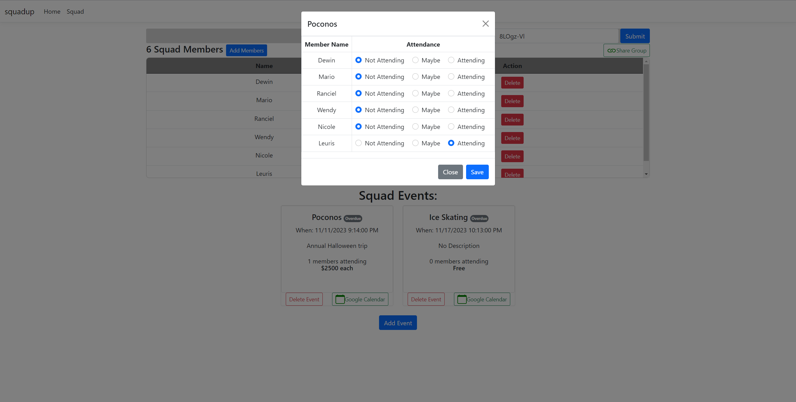

# Group Event Attendance App (Squadup)

This minimal web app facilitates event planning among my friends.

## Features

- Create groups
- Add members to group
- Add events to group
- Members can click on events and submit their attendance.
- Events are integrated with Google Calendars API for allowing members to add events to their calendar.

## Highlights

- MVC based with Ajax
- Integration with Google Calendars API
- PostgreSQL to manage data
- Hosted on Azure App Services and Databases: https://squadup-app.azurewebsites.net/
